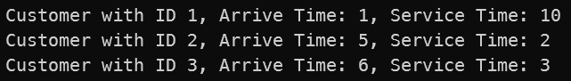
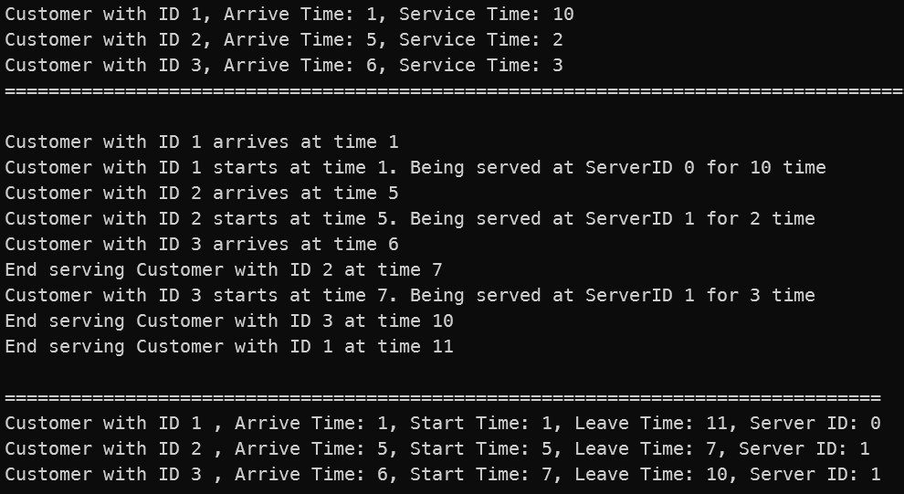
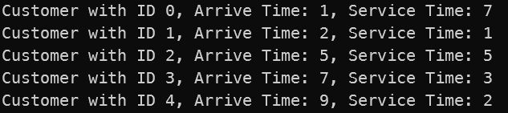
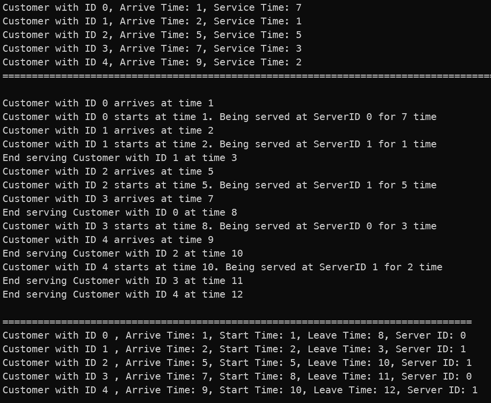

# 进程间同步互斥问题：银行柜员服务问题

## 问题描述

银行有 n 个柜员负责为顾客服务，顾客进入银行先取一个号码，然后等着叫号。当某个柜员空闲下来，就叫下一个号。

编程实现该问题，用 P、V 操作实现柜员和顾客的同步。

## 实现要求

1. 某个号码只能由一名顾客取得；
2. 不能有多于一个柜员叫同一个号；
3. 有顾客的时候，柜员才叫号；
4. 无柜员空闲的时候，顾客需要等待；
5. 无顾客的时候，柜员需要等待。

## 实验平台

Windows OS；编程语言 C# 10（.NET 6）

## 实验原理

使用信号量的 P、V 操作，控制线程间的同步与互斥关系。对于共享资源的访问与修改，可以使用锁进行控制。

C# 中提供了 `System.Threading` 命名空间，进行线程相关的操作。本次实验中主要用到其中的两种类：

1. `System.Threading.Thread` 类，为 C# 中的线程类。
2. `System.Threading.Semaphore` 类，为 C# 中的信号量类。

本次实验中还将用到 C# 中锁的语法：`lock (Object obj)`，用于上锁与解锁，这里的 `obj` 对象可以认为是锁。锁理论上可以用 P、V操作实现，是一种方便的接口。锁实现的伪代码如下：

~~~
sema = new SemaPhore(obj); // 创建 obj 对象对应的信号量
P(sema)
// 执行操作
V(sema)
~~~

本实验中为了方便，直接使用 C# 的 lock 语法实现锁。

## 实现思路

本任务中主要涉及两种对象：顾客与银行。

顾客类，需包含顾客的 ID、到达时间、服务时间等属性，是要被服务的对象。主要的协调算法在银行类中实现。

### 1.顾客加入时

根据问题描述，顾客依次进入银行，等待被服务，因此需要在银行中维护一个队列 `customersQueue`，每当有顾客加入，就往这个队列里添加一名顾客。注意，由于可能有顾客同时加入，因此对 `customersQueue` 的操作需要控制互斥，因此需要上锁。

当有顾客加入时，根据问题需求，此时银行需要进行协调，这里我在顾客加入后，尝试进行叫号的操作，具体分析见第 2 点。

顾客加入时的代码如下

~~~C#
public class Bank
{ 
    
    // ......
    
    public void JoinCustomer(Customer customer)
    {
        lock (this.customersQueueLock)
        {
            customersQueue.Enqueue(customer);
        }
        Console.WriteLine($"{customer} arrives at time {(Environment.TickCount - this.initTime) / this.timeInterval}");
        new Thread(() => TryServeCustomer()).Start();
    }
}
~~~

### 2.尝试叫号

顾客加入时，尝试叫号，执行 `TryServeCustomer` 的操作。这里需要用信号量控制线程间的同步关系。

设置一个信号量 `attendantSema` ，用于表示当前柜员的个数，初始化为最大柜员数量；同时维护一张柜员表，记录每个柜员是否正在工作。

每当执行 `TryServeCustomer` 时，需要尝试将柜员个数减 1，这对应着信号量 `attendantSema` 的 P 操作。如果有空闲柜员，则说明原始信号量 `attendantSema` 值大于 0，进行 P 操作后不会阻塞，可以分配一个柜员给对应的顾客。此时将顾客从顾客队列 `customerQueue` 中取出，分配给一个空闲的柜员，更新记录柜员表；若当前已经没有空闲柜员了，则信号量执行 P 操作后会阻塞，直到有柜员服务完毕再度变为空闲时，才会从阻塞中恢复。由于柜员表的读写可能同时进行，因此需要锁变量控制柜员表的访问。

成功分配柜员给顾客后，则将进行模拟服务操作，见第 3 点。

尝试叫号的代码如下

~~~C#
public class Bank
{ 
    
    // ......
    
    public void TryServeCustomer()
    {
        this.attendantSema.WaitOne();
        Customer customer;
        lock (this.customersQueueLock)
        {
            customer = this.customersQueue.Dequeue();
        }
        lock (this.serversLock) // 分配空闲柜员
        {
            var server = this.availServers.First(kvp => !kvp.Value);
            this.availServers[server.Key] = true;
            customer.ServerID = server.Key;
        }
        customer.StartTime = (Environment.TickCount - this.initTime) / this.timeInterval;
        new Thread(() =>
        {
            // 模拟服务操作
        }).Start();
    }
}
~~~

### 3.模拟服务

当顾客成功匹配空闲的柜员时，则开始模拟服务操作。这里直接通过线程睡眠的方式模拟服务。

在服务结束后，要将接待顾客的柜员重新置为空闲，即修改柜员记录表；然后要释放信号量 `attendantSema`，代表此服务已结束，有柜员重归空闲。

具体代码如下

~~~C# 
// 模拟服务操作
Console.WriteLine($"{customer} starts at time {customer.StartTime}. Being served at ServerID {customer.ServerID} for {customer.ServiceTime} time");
Thread.Sleep(customer.ServiceTime * this.timeInterval);
customer.LeaveTime = customer.StartTime + customer.ServiceTime;
Console.WriteLine($"End serving {customer} at time {customer.LeaveTime}");
lock (this.serversLock)
{
    this.availServers[customer.ServerID] = false;
}
this.attendantSema.Release();
~~~

## 具体细节

### 1.模拟顾客到来

模拟顾客依次到来，只需保证顾客按照给定的时间加入银行队列即可。进入银行可通过银行类的 `JoinCustomer` 函数实现。

具体模拟方式如下

~~~C# 
var sleepTime = customerList[0].ArriveTime;
Thread.Sleep(sleepTime * timeInterval);
bank.JoinCustomer(customerList[0]);
for (int i = 1; i < customerList.Count; i++)
{
    sleepTime = customerList[i].ArriveTime - customerList[i - 1].ArriveTime;
    Thread.Sleep(sleepTime * timeInterval);
    bank.JoinCustomer(customerList[i]);
}
~~~

这里通过睡眠，控制每个顾客到来的时间。

### 2.判断所有顾客都已完成服务

直接判断所有顾客是否都完成服务比较麻烦，这里直接估计出所有顾客完成服务的时间上限，然后阻塞主线程，确保最终所有顾客都已完成服务后再显示最终结果。

所有顾客完成服务的时间上限为：在所有顾客都加入银行后，至多还需要等待 "所有顾客的服务时长 + 第一个顾客到达的时间 - 最后一个顾客到达的时间"。这个上限可以通过假设银行只有一个柜员来得到。

具体代码如下：

~~~C#
var maxPossibleSleepTime = customerList.Select(x => x.ServiceTime).Sum() + customerList[0].ArriveTime - customerList[customerList.Count - 1].ArriveTime;
Thread.Sleep(maxPossibleSleepTime * timeInterval + timeInterval);

Console.WriteLine();
Console.WriteLine("================================================================================");
foreach (var customer in customerList)
{
    Console.WriteLine($"{customer} , Arrive Time: {customer.ArriveTime}, Start Time: {customer.StartTime}, Leave Time: {customer.LeaveTime}, Server ID: {customer.ServerID}");
}
~~~

### 3.时间控制

在模拟银行柜员服务问题中，需要记录各顾客的到达、开始服务、结束服务的时间。这里通过线程睡眠阻塞的方式模拟顾客服务，并通过使用 C# 中的 `System.Environmnet.TickCount` 获得当前时间，并与初始时记录的时间作差，得到目前程序执行的时间。

在程序中，我设置单位时间长度 `timeInterval=200ms` 进行模拟。单位时间长度不宜太小，否则模拟将不精确。

## 实验模拟

构造测例如下

### 测例1

指定柜员数目为 2，运行结果如下：

理论分析知：

1. 顾客 1 在 3 时刻到达，服务 10，应当在 13 结束，分配柜员 0；
2. 顾客 2 在 5 时刻到达，此时仍有空闲柜员，分配柜员 1 后继续执行；
3. 顾客 3 在 6 时刻到达，此时没有空闲柜员，需等到时刻 7 顾客 2 执行完毕后，到顾客 3 执行，柜员号与顾客 2 相同，为 1。

程序执行结果与理论分析一致，结果正确。

### 测例2

指定柜员数目为 2，运行结果如下：

理论分析知：

1. 顾客 0 于 1 时刻到达，执行 7 时间，分配柜员 0 。
2. 顾客 1 于 2 时刻到达，执行 1 时间，分配柜员 1 。
3. 顾客 2 于 5 时刻到达，此时柜员 0 未结束，柜员 1 已结束，因此会给顾客 2 分配柜员 1，继续执行。
4. 顾客 3 于 7 时刻到达，此时柜员 0,1 都不空闲，需等到 8 时刻，柜员 0 服务完顾客 0 后，才能开始被服务。
5. 柜员 4 于 9 时刻到达，此时柜员 0,1 都不空闲，需等到 10 时刻，柜员 1 服务完顾客 2 后，才能开始被服务。

程序最终结果与理论分析一致，结果正确。

## 思考题

### 1.柜员人数和顾客人数对结果分别有什么影响？

理论上说，固定顾客人数，随着柜员人数增加时，服务完所有顾客的总时间会先迅速下降，再平缓下降。当增加到柜员人数大于顾客人数时，总时间不会再变化。

原因是，当柜员人数较小时，顾客人数相对较多，柜员非常忙碌，大部分时间里都处在工作状态，每增加一个柜员，就能迅速缓解顾客的需求。当柜员人数逐渐增加后，部分柜员便有部分时间会处于空闲状态，而不是总处于工作状态。此时再增加柜员人数，对总时间的影响会逐渐变小。当柜员人数增加到大于顾客人数时，此时柜员总是充足的，总时间由顾客人数决定。

固定柜员人数，随着顾客人数的增加，顾客较少时，总时间增加的比较缓慢，随着顾客逐渐增加（到远大于柜员人数），此时总时间与顾客人数的关系基本呈线性。

原因是，当顾客较少时，柜员是相对充足的，顾客人数对总时间影响较小；而当顾客逐渐增多，远大于柜员人数时，柜员总是处于忙碌状态，而后到的顾客长时间处于等待被服务中，顾客人数越多等待的人就越多，总时间会线性增长。

### 2.实现互斥的方法有哪些？各自有什么特点？效率如何？

1. 忙等待方法。通过循环不断判断某些变量的值，直到该变量的值发生改变，才跳出循环执行之后的语句。这种算法实现简单，但会占用 CPU 资源。且如果不能设计好，还可能会引起多进程（线程）同时访问临界区的错误。使用效率上，由于该方法会持续占用 CPU 资源，所以效率较低，不宜在等待时间较长的场景下使用。
2. 中断禁用法。进程（线程）的打断要通过中断。在进入临界区前禁用中断即可实现互斥。这种方法在平常用户编程中不常用，因为需要操作系统支持，将控制中断的接口暴露。而且这种方法有很大的风险，例如在临界区中的操作倘若发生异常，由于中断被关闭，程序很有可能崩溃或直接卡死，造成严重的后果。
3. 信号量方法。信号量方法通过原子操作实现互斥。该方法会阻塞进程（线程），不会占用 CPU 资源，效率高，是一种常用的控制同步或互斥的方法。但是大量使用信号量（或通过其实现的锁）也可能会带来不小的开销。

## 实验体会

本次实验中通过模拟的方法解决银行柜员服务问题。其中，对于单位时间长度的我有一点体会。由于程序在执行中还是会消耗一定时间的，所以单位时间长度不宜太小，否则容易出错。在我的反复尝试下，我认为单位时间长度在 `200ms` 及以上是比较合适的。本次实验中设置为 `200ms`。

## 文件说明

`BankServices/`：源代码与项目文件

`publish/`：可执行文件与依赖项

`TestFiles/`：测试文件

`run.cmd`：运行 `publish/BankServices.exe` 程序

- `publish/BankServices.exe` 参数指定：
  - `--fileName`：测试文件路径
  - `--serverNum`：柜员个数
  - `--timeInterval`：单位时间长度（ms）